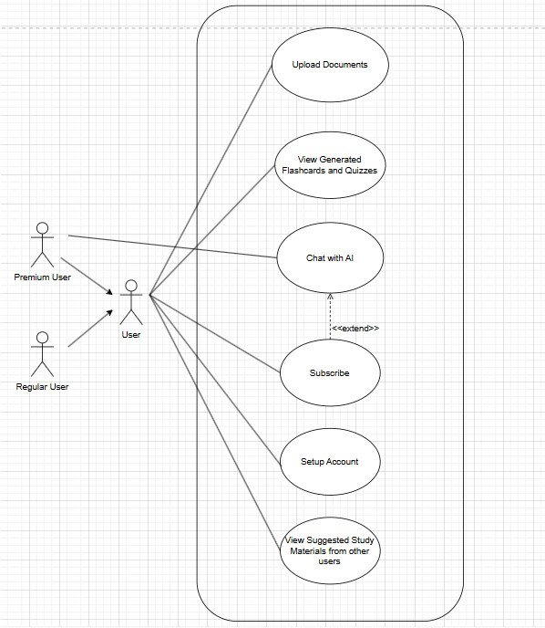
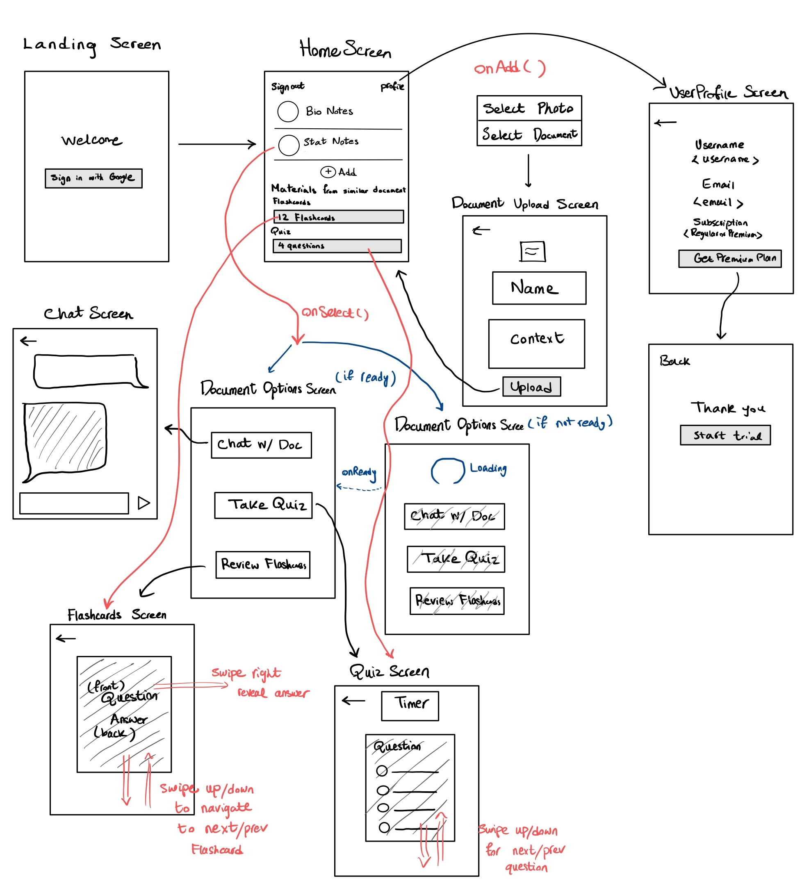
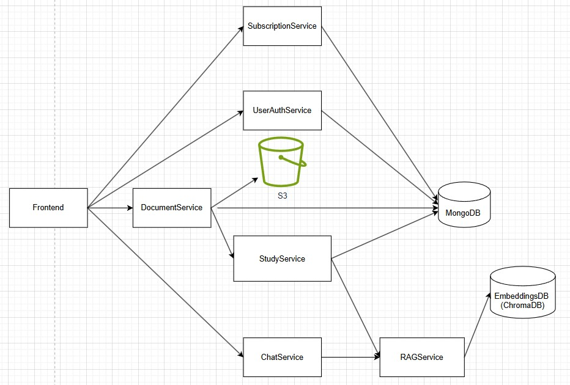

# M3 - Requirements and Design

## 1. Change History
- Added new feature that allows users to view suggested quizzes and flashcards that are created by other users, algorithm recommends quizzes and flashcards most similar to what a user has been studying
    - Date of Modification: Feb 28
    - Modified Sections: 3.1, 3.3, 4.4, 4.6, 4.8
    - Rationale: new feature to showcase a complex algorithm that calculates document similarity with cosine similarity between a user's document and every other document that exists in the app.
- On document upload, flashcards and quizzes are generated as a background process for that document, so users can only create quizzes and flashcards from a document upload directly.
    - Date of Modification: Feb 26
    - Modified Sections: 3.1, 3.3, 4.4, 4.6
    - Rationale: this allows users to still browse the application while their study materials are generating as the processing of the documents are now unblocking; improves user experience.
- DocumentParser and DocumentSummarizer are no longer separate components but merged with DocumentService
    - Date of Modification: Feb 26
    - Modified Sections: 3.3, 4.4, 4.6
    - Rationale: There was no reason to decouple these functionalities together as they are very similar; text extraction or document text processing shouldn't be its own interface, but is just one part of the document upload processing.
- Changed subscription to be free
    - Date of Modification: Feb 24
    - Modified Sections: 3.3, 4.4, 4.6
    - Rationale: Payments are not central to the user application and to allow more users to test our chat feature, we decided to make it free for now.
- Coupled StudyResourceDB and UserDB into a single MongoDB database and defined MongoDB schemas for app resources
    - Date of Modification: Feb 25
    - Modified Sections: 4.2, 4.6
    - Rationale: There was no point in separating StudyResourcesDB and UserDB into two separate databases, it made more sense to keep them in one database but as separate collections in MongoDB to make finding user's owned documents easier and lessens complexity with a single DB. We defined the schemas to be able to represent application data in the database for flashcards, quizzes, documents, users, and chat so that data is saved.
- Google Authenticator is now only on the frontend and no longer used in the backend
    - Date of Modification: Feb 25
    - Modified Sections: 4.6
    - Rationale: Google authenticator is already used on the frontend, so doing it again on the backend was unneccessary.

- Frontend design changes:
    - landing screen only has the Google sign in button
    - payment screen allows users to start their free trial
    - document details screen was renamed to document upload screen, minor changes to the document upload screen design
    - loading page was removed, instead the document options screen has two different views, one when all study materials are ready, and one when the study materials are still being generated.

## 2. Project Description

Thinkr is an Android mobile app that is geared towards helping students study through AI-generated multiple-choice quizzes and notes. Students can upload a document, and quizzes and flashcards are automatically generated for that document, then they can view those quizzes and flashcards after. They may also ask a chatbot questions about the document uploaded. Students are also able to view quizzes and flashcards created by other users that are similar to theirs for extra study material.

## 3. Requirements Specification

### **3.1. Use-Case Diagram**


### **3.2. Actors Description**

1. **Regular users**: Can access basic features like document upload, flashcards, and quizzes.
2. **Premium users**: Can use all regular features plus chat with an AI assistant about their uploaded documents.

Note: Users and Students will be used synonymously in this document.

### **3.3. Functional Requirements**

1. **Setup Account** 
    - **Description**: Users can sign up and log in.
    - **Primary actor(s)**: Premium and regular students.
    - **Main success scenario**:
        1. Users are able to create accounts and are able to log in to the account they just created.
    - **Failure scenario(s)**:
        1a. Users create an account and are unable to log into the account that they tried to create.
            1a1. An error message is displayed on the screen telling them login was unsuccessful.

2. **Subscribe** 
    - **Description**: Users can upgrade to premium status for additional features.
    - **Primary actor(s)**: Premium and regular users.
    - **Main success scenario**:
        1. User successfully obtains premium status.
    - **Failure scenario(s)**:
        1a. Subscription update fails.
            1a1. System shows an error message explaining the failure.

3. **Upload Documents**
    - **Description**: Users can upload documents (PDF or image) to the application for processing and generates a quiz and a flashcard set based on the documents uploaded.
    - **Primary actor(s)**: Regular and Premium Users.
    - **Main success scenario**:
        1. User successfully uploads the document.
        2. System processes the document and generates study materials.
    - **Failure scenario(s)**:
        1a. File upload fails to be uploaded.
            1a1. If the upload failed due to network errors, show a message asking user to check their connection.
            1a2. If the format of the document is not supported, show a message asking user to check their file format.
            1a3. UI tells user to try again and reupload their document.

4. **Chat with AI**
    - **Description**: Premium users can chat with the AI about the documents they have uploaded.
    - **Primary actor(s)**: Premium Users.
    - **Main success scenario**:
        1. The AI returns context-aware responses in the chat.
        2. The AI understands the information of the uploaded documents.
    - **Failure scenario(s)**:
        1a. App fails to return a response because of the Network Error.
            1a1. Show a message asking user to check their connection.
        2b. User's message exceeds the context length limit.
            2b1. Disable the send button, and user cannot send until they shorten their input.

5. **View Generated Flashcards and Quizzes**
    - **Description**: Users can browse and interact with AI-generated flashcards and quizzes based on the documents uploaded.
    - **Primary actor(s)**: Regular and Premium Users.
    - **Main success scenario**:
        1. User can use the flashcards that were generated after they uploaded a document
        2. User can use the quiz that was generated after they uploaded a document
    - **Failure scenario(s)**:
        1a. Flashcards are not generated due to errors.
            1a1. Asks user to re-upload their document and try again.
        2a. Quiz is not generated due to errors.
            2a1. Asks user to re-upload their document and try again.

6. **View Suggested Study Materials From other users**
    - **Description**: Users can retrieve suggested flashcards and quizzes that other users have created based on similarity between two user's uploaded documents
    - **Primary actor(s)**: Regular and Premium Users.
    - **Main success scenario**:
        1. User can retrieve flashcards and quizzes from other users based on document similarity and use them
    - **Failure scenario(s)**:
        1a. No quizzes or flashcards are retrieved.
            1a1. Tells user that no quizzes or flashcards can be retrieved because we could not find any quizzes or flashcards similar to theirs.
            1a2. UI tells the user to try to upload documents again later.

### **3.4. Screen Mockups**



### **3.5. Non-Functional Requirements**

**Quiz/flashcard generation performance**
    - **Description**: The amount of time it takes to generate a quiz or a flashcard via documents must take no longer than 10 seconds.
    - **Justification**: This is relevant to user experience as faster response times keep them more engaged with our app and can proceed with their studying quicker. Slow response times may result in users not wanting to interact with our app as much.

## 4. Designs Specification

### **4.1. Main Components**

1. **UserAuthService**
    - **Purpose and rationale**: Encapsulates functionalities related to users such as account creation, and login.

2. **DocumentService**
    - **Purpose and rationale**: Encapsulates functionalities related to documents such as retrieving, creating, deleting, and text extraction.

3. **SubscriptionService**
    - **Purpose and rationale**: Handles user subscriptions to differentiate regular and premium users.

4. **ChatService**
    - **Purpose and rationale**: Encapsulates functionalities related to message streaming with the chatbot trained on the selected document's context such as creating a session and receiving/sending messages.

5. **RAGService**
    - **Purpose and rationale**: Fetches documents from the vector database and prompts LLM with query + relevant context.

6. **StudyService**
    - **Purpose and rationale**: Generates and allows for retrieval of flashcards and quizzes based on the extracted text of a provided document.


### **4.2. Databases**  

1. **MongoDB Collections**
   - **Users**: Stores user account information
     - Fields: email, name, googleId, subscribed
   - **Documents**: Stores document metadata
     - Fields: name, documentId, userId, uploadDate, s3documentId, activityGenerationComplete
   - **FlashcardSets**: Stores flashcard content for specific documents
     - Fields: userId, documentId, flashcards (array of {front, back})
   - **QuizSets**: Stores quiz content for specific documents
     - Fields: userId, documentId, quiz (array of {question, answer, options})
   - **ChatSessions**: Stores chat history
     - Fields: sessionId, googleId, documentId, messages, createdAt, updatedAt, metadata

2. **AWS S3**
   - **Document Storage**: Stores the actual document files uploaded by users

3. **ChromaDB (Vector Database)**
   - **Purpose**: Stores document embeddings for semantic search
   - **Collections**: One collection per user (user_{userId})
   - **Fields**: Document chunks with metadata including documentId, userId, and chunking information
     

### **4.3. External Modules**

1. **Google Authentication** 
    - **Purpose**: Facilitating user login.

2. **LLM API: OpenAI**
    - **Purpose**: Used for the chat-with-document feature, and for generating the quiz and flashcards.

### **4.4 Interfaces**

1. **UserService**

    ```java
    /**
    * Handles login/signup for a user after having logged in through Google Auth in frontend
    *
    * @param googleId The Google ID of the user
    * @param name The name of the user
    * @param email The email of the user
    * @return User object containing user information including subscription status
    */
    User login(String googleId, String name, String email);
    ```

2. **DocumentService**

    ```java
    /**
     * Uploads a document and starts async generation of study materials.
    *
    * @param file The document file (PDF, JPEG, PNG, TIFF, or text)
    * @param userId The Google ID of the user
    * @param documentName The user's name for this document
    * @param context Optional user-provided context about the document
    * @return Document metadata including generation status
    */
    Document uploadDocument(File file, String userId, String documentName, String context);

    /**
    * Deletes a document and all associated study materials.
    *
    * @param userId The Google ID of the user
    * @param documentId The ID of the document to delete
    * @return True if deletion was successful
    */
    boolean deleteDocument(String userId, String documentId);

    /**
    * Retrieves documents for a user, either all documents or a specific one.
    *
    * @param userId The Google ID of the user
    * @param documentId Optional ID of a specific document to retrieve
    * @return List of document metadata or a single document
    */
    List<Document> getDocuments(String userId, String documentId);
    ```

3. **SubscriptionService**

    ```java
    /**
    * Upgrades a user to premium subscription status.
    *
    * @param userId The Google ID of the user
    * @return Updated user data with subscription status set to true
    */
    User subscribe(String userId);

    /**
    * Downgrades a user to regular subscription status.
    *
    * @param userId The Google ID of the user
    * @return Updated user data with subscription status set to false
    */
    User unsubscribe(String userId);

    /**
    * Gets user subscription status
    *
    * @param userId The Google ID of the user
    * @return user data along with subscription status
    */
    User getSubscriptionStatus(String userId);
    ```

4. **ChatService**

    ```java
    /**
     * Creates a new chat session.
    *
    * @param userId The Google ID of the user
    * @param metadata Optional metadata including source, topic, and optional documentId
    * @return New chat session data
    */
    ChatSession createChatSession(String userId, Map<String, Object> metadata);

    /**
    * Sends a message to an existing chat session and gets an AI response.
    *
    * @param sessionId The unique ID of the chat session
    * @param message The user's message text
    * @return AI-generated response
    */
    String sendChatMessage(String sessionId, String message);

    /**
    * Retrieves a specific chat session with its message history.
    *
    * @param sessionId The unique ID of the chat session
    * @return Chat session data including message history
    */
    ChatSession getChatSession(String sessionId);

    /**
    * Deletes a chat session.
    *
    * @param sessionId The unique ID of the chat session to delete
    * @return True if deletion was successful
    */
    boolean deleteChatSession(String sessionId);

    /**
    * Gets all chat sessions for a user, optionally filtered by document.
    *
    * @param userId The Google ID of the user
    * @param documentId Optional document ID to filter by
    * @return List of chat sessions
    */
    List<ChatSession> getUserChatSessions(String userId, String documentId);
    ```

5. **RAGService**

    ```java
    /**
     * Queries documents using Retrieval Augmented Generation.
    *
    * @param query The user's question
    * @param userId The Google ID of the user
    * @param documentId Optional ID of a specific document to query (null to search all user documents)
    * @return AI-generated answer based on the user's documents
    */
    String queryDocuments(String query, String userId, String documentId);
    ```

6. **StudyService**

    ```java
    /**
     * Generates flashcards based on a document.
    *
    * @param userId The Google ID of the user
    * @param documentId The ID of the document
    * @return Generated flashcards as term-definition pairs
    */
    FlashcardDTO generateFlashcards(String userId, String documentId);

    /**
    * Generates a multiple-choice quiz based on a document.
    *
    * @param userId The Google ID of the user
    * @param documentId The ID of the document
    * @return Generated quiz with questions, options, and correct answers
    */
    QuizDTO generateQuiz(String userId, String documentId);

    /**
    * Retrieves quizzes for a user, optionally filtered by document.
    *
    * @param userId The Google ID of the user
    * @param documentId Optional ID to filter by a specific document
    * @return List of quizzes or a single quiz
    */
    Object retrieveQuizzes(String userId, String documentId);

    /**
    * Retrieves flashcards for a user, optionally filtered by document.
    *
    * @param userId The Google ID of the user
    * @param documentId Optional ID to filter by a specific document
    * @return List of flashcards or a single flashcard set
    */
    Object retrieveFlashcards(String userId, String documentId);

    /**
    * Retrieves flashcards and quizzes that other people have uploaded for a user based on documents similarity 
    *
    * @param userId The Google ID of the user
    * @return List of flashcards and quizzes 
    */
    Object getSuggestedStudyMaterials(String userId);
    ```

### **4.5. Frameworks**

1. **AWS (Textract and EC2)**
    - **Purpose**: Used for deployment and extracting text from files.
    - **Reason**: AWS provides easy to access OCR tools and a quick way to deploy our backend onto the cloud.

2. **LangChain**
    - **Purpose**: For constructing input and output of RAG.
    - **Reason**: LangChain is one of the only services that can do vector comparison of the embeddings.

3. **Node.js**
    - **Purpose**: Used for backend development.
    - **Reason**: Node.js allows for efficient development of backend web services with TypeScript.

4. **Express.js**
    - **Purpose**: Used for backend development in the Node.js runtime environment.
    - **Reason**: Express.js allows for efficient development of REST APIs in the Node.js runtime environment.

5. **Jetpack Compose**
    - **Purpose**: Used for Android UI development.
    - **Reason**: Jetpack Compose allows for declarative implementation of UI in Kotlin for better maintainability, ease of UI testing with Compose testing, and intuitive use of Kotlin APIs.

6. **Retrofit**
    - **Purpose**: Type-safe HTTP Client for the JVM.
    - **Reason**: Retrofit allows us to consume REST APIs from the Android app to build scalable API calls.

7. **Ktor**
    - **Purpose**: Ktor WebSocket Client can be used to enable the real-time chat functionality with the chatbot.
    - **Reason**: Ktor integrates nicely with Kotlin APIs.

8. **MongoDB**
    - **Purpose**: Storing user account information.
    - **Reason**: Flexible NoSQL database that can be easily used for different scenarios.

9. **ChromaDB**
    - **Purpose**: To store the vector embeddings of the documents.
    - **Reason**: It is inexpensive, efficient, and easy to use.

### **4.6. Dependencies Diagram**



### **4.6. Functional Requirements Sequence Diagram**
1. [**[Setup Account]**](#fr1)\


2. [**[Subscribe]**](#fr1)\


3. [**[Upload Documents]**](#fr1)\


4. [**[Chat with AI]**](#fr1)\


5. [**[View Generated Flashcards and Quizzes]**](#fr1)\


6. [**[View Suggested Study Materials From other users]**](#fr1)\


### **4.7. Non-Functional Requirements Design**
1. [**[Quiz/flashcard generation performance]**](#nfr1)
    - **Validation**: We will implement a fan out pattern for extracting text from files by multithreading text extraction for each page (extract multiple pages at the same time). Also, while the user is providing information about the document, we will start uploading the document in the background so that the back-end can start parsing earlier to make quiz/flashcard generation appear a lot faster.
2. [**[Responsive UI/UX]**](#nfr1)
    - **Validation**: We will create loading animations for different front-end components, specifically for when the user is waiting for the document to be uploaded and parsed, or waiting for a reply from the back-end.

### **4.8. Main Project Complexity Design**

**Calculating Documents Similarity**
- **Description**: This feature (use case #7) suggests study materials (flashcards and quizzes) to users based on similarity between their documents and other users' documents. The core of this feature is the similarity calculation between users' documents to determine what flashcards and quizzes to show to a user that are similar to what they usually study.
- **Why complex?**: Vector similarity calculation requires multidimensional embedding comparison across potentially hundreds of documents. Cosine similarity computation between high-dimensional vectors is computationally intensive and must be optimized to maintain acceptable performance at scale. We are comparing a user's documents to every other user's documents in the system to find the most similar materials.
- **Design**:
   - **Input**: 
       - User ID (for whom to provide suggestions)
       - Optional limit parameter (maximum number of suggestions to return)
   - **Output**: 
       - Suggested flashcards from similar documents
       - Suggested quizzes from similar documents
   - **Main computational logic**: 
       - Retrieve all documents for the user
       - For each user document, find similar documents from other users using vector similarity
       - Sort results by similarity score and take top matches
       - Retrieve associated flashcards and quizzes for matching documents
   - **Pseudo-code**:
       ```python
       def get_suggested_materials(user_id, limit=5):
           # Get all documents for the user
           user_documents = get_user_documents(user_id)
           
           if empty(user_documents):
               return empty_result()
           
           # Find similar documents from other users
           similar_documents = find_similar_documents(user_id, user_documents, limit)
           
           if empty(similar_documents):
               return empty_result()
           
           # Fetch study materials for similar documents
           suggested_materials = {
               "flashcards": get_flashcards_for_documents(similar_documents),
               "quizzes": get_quizzes_for_documents(similar_documents)
           }
           
           return suggested_materials
       
       
       def find_similar_documents(user_id, user_documents, limit):
           # Get documents from other users
           other_users_documents = get_documents_excluding_user(user_id)
           
           # Calculate similarity between user documents and other users' documents
           similarity_results = []
           
           for user_doc in user_documents:
               user_doc_text = get_document_text(user_doc.id, user_id)
               
               for other_doc in other_users_documents:
                   other_doc_text = get_document_text(other_doc.id, other_doc.user_id)
                   
                   # Calculate vector similarity between documents
                   similarity_score = calculate_document_similarity(user_doc_text, other_doc_text)
                   
                   if similarity_score > SIMILARITY_THRESHOLD:
                       similarity_results.append({
                           "document": other_doc,
                           "score": similarity_score
                       })
           
           # Return top similar documents sorted by similarity score
           return get_top_results(similarity_results, limit)
       
       
       def calculate_document_similarity(text1, text2):
           # Convert texts to vector embeddings
           embedding1 = get_embedding(text1)
           embedding2 = get_embedding(text2)
           
           # Calculate cosine similarity between embeddings
           return cosine_similarity(embedding1, embedding2)
       ```

## 5. Contributions

- **Ray Ho**
    - Writing requirement specifications (actors, functional and non-functional requirements)
    - Creating the use case diagram
    - Creating sequence diagrams for case functional requirements 1-3
    - Coming up with some frameworks, components and interfaces for those components
    - Setup backend with standard API patterns
    - Set up MongoDB and schemas for user, flashcards, documents, quizzes
    - Created user login feature
    - Created document service for uploading to MongoDB, S3 and ChromaDB, retrieving, and deleting documents and text extraction
    - Created flashcards and quiz generation feature
    - Created subscription feature

- **Parshan Javanrood**
    - Helped with designing the user flow and Drew screen mockups
    - Assisted in selecting frameworks for the RAG and AI components based on project requirements
    - Contributed to the design of core system components, database schema, and evaluating trade-offs between different architectures
    - Helped define both functional and non-functional requirements to align with project objectives

- **Jaiden Siu**
    - Worked on design specifications of main components, interfaces, and tech stack
    - Refined components, tech stack, and user requirements to ensure scaleable design
    - Created design diagram
    - Participated in frontend design and mockups discussions

- **Anthony Ji**
    - Worked on the system design with focus on scalability and performance
    - Instantiated and worked on the algorithm implementation design including constraints, logics, and architecture
    - Created sequence diagrams for functional requirements 4-7 (Conversational AI, Document Parser, RAG Service, Review Flashcards)
    - Planned and designed the Gen AI orchestrator for efficient document processing and response generation
    - Integrated backend with the Retrieval-Augmented Generation (RAG) service for AI-driven document interaction, ChatService for persistent conversation feature, and a Suggested Materials feature for recommending similar study resources based on document embeddings stored in ChromaDB. 
    - Involved in designing and linking the database (MongoDB for user data and chat history, ChromaDB for vector storage), integrating document similarity search, ensuring persistent vector storage, and implementing OpenAI embeddings.
