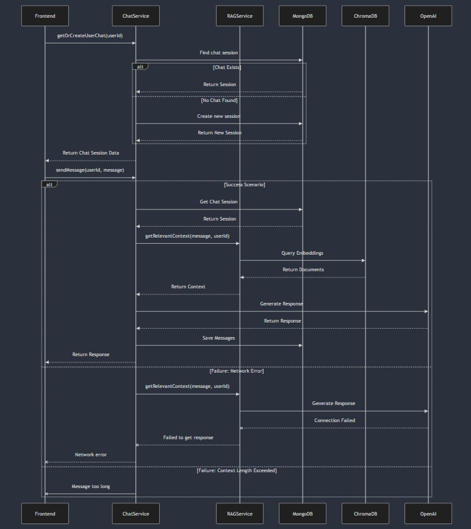

# M3 - Requirements and Design

## 1. Change History
- Removed unused endpoints like generateQuizzes and generateFlashcards from StudyService interface
   - Date of Modification: Mar 12
   - Modified Sections: 4.4
   - Rationale: these endpoints are not used so we removed them
- Fixed use case diagram to be more generalized and fixed sequence diagram and dependency diagram logic
    - Date of Modification: Mar 2
    - Modified Sections: 3.1, 4.6, 4.7
    - Rationale: use case diagram now reflects the newly changed use cases, sequence diagrams now are fixed with correct logic including database fetching, dependency diagram now correctly uses the named interfaces.
- Replaced second non functional requirement with optimizing the similarity search for the suggested materials feature
    - Date of Modification: Mar 2
    - Modified Sections: 3.5, 4.8
    - Rationale: the old UI responsiveness cannot be tested quantitatively and with this newly added feature, it made more sense to optimize it as it is computationally heavy since every document has to be compared with every other document in the database.
- Added new feature that allows users to view suggested quizzes and flashcards that are created by other users, algorithm recommends quizzes and flashcards most similar to what a user has been studying
    - Date of Modification: Feb 28
    - Modified Sections: 3.1, 3.3, 4.4, 4.7, 4.9
    - Rationale: new feature to showcase a complex algorithm that calculates document similarity with cosine similarity between a user's document and every other document that exists in the app.
- On document upload, flashcards and quizzes are generated as a background process for that document, so users can only create quizzes and flashcards from a document upload directly.
    - Date of Modification: Feb 26
    - Modified Sections: 3.1, 3.3, 4.4, 4.7
    - Rationale: this allows users to still browse the application while their study materials are generating as the processing of the documents are now unblocking; improves user experience.
- DocumentParser and DocumentSummarizer are no longer separate components but merged with DocumentService
    - Date of Modification: Feb 26
    - Modified Sections: 3.3, 4.4, 4.7
    - Rationale: There was no reason to decouple these functionalities together as they are very similar; text extraction or document text processing shouldn't be its own interface, but is just one part of the document upload processing.
- Coupled StudyResourceDB and UserDB into a single MongoDB database and defined MongoDB schemas for app resources
    - Date of Modification: Feb 25
    - Modified Sections: 4.2, 4.7
    - Rationale: There was no point in separating StudyResourcesDB and UserDB into two separate databases, it made more sense to keep them in one database but as separate collections in MongoDB to make finding user's owned documents easier and lessens complexity with a single DB. We defined the schemas to be able to represent application data in the database for flashcards, quizzes, documents, users, and chat so that data is saved.
- Google Authenticator is now only on the frontend and no longer used in the backend
    - Date of Modification: Feb 25
    - Modified Sections: 4.7
    - Rationale: Google authenticator is already used on the frontend, so doing it again on the backend was unneccessary.

- Frontend design changes [Modified section 3.4]:
    - landing screen only has the Google sign in button [Date: Feb 25] 
    - payment screen allows users to start their free trial [Date: Feb 25]
    - document details screen was renamed to document upload screen, minor changes to the document upload screen design [Date: Feb 27]
    - loading page was removed, instead the document options screen has two different views, one when all study materials are ready, and one when the study materials are still being generated [Date: Feb 28]
    - Rationale: these were design changes that made more sense UI/UX wise so we tweaked the frontend design to match those changes to better fit our app

## 2. Project Description

Thinkr is an Android mobile app that is geared towards helping students study through AI-generated multiple-choice quizzes and notes. Students can upload a document, and quizzes and flashcards are automatically generated for that document, then they can view those quizzes and flashcards after. They may also ask a chatbot questions about the document uploaded. Students are also able to view quizzes and flashcards created by other users that are similar to theirs for extra study material.

## 3. Requirements Specification

### **3.1. Use-Case Diagram**


### **3.2. Actors Description**

1. **Regular users**: Can access basic features like document upload, flashcards, and quizzes.
2. **Premium users**: Can use all regular features plus chat with an AI assistant about their uploaded documents.

Note: Users and Students will be used synonymously in this document.

### **3.3. Functional Requirements**

1. **Setup Account** 
    - **Description**: Users can sign up and log in.
    - **Primary actor(s)**: Premium and regular students.
    - **Main success scenario**:
        1. Users are able to create accounts and are able to log in to the account they just created.
    - **Failure scenario(s)**:
        - 1a. Users create an account and are unable to log into the account that they tried to create.
            - 1a1. An error message is displayed on the screen telling them login was unsuccessful. 

2. **Subscribe** 
    - **Description**: Users can upgrade to premium status for additional features.
    - **Primary actor(s)**: Premium and regular users.
    - **Main success scenario**:
        1. User successfully obtains premium status.
    - **Failure scenario(s)**:
        - 1a. Subscription update fails.
            - 1a1. System shows an error message explaining the failure.

3. **Upload Documents**
    - **Description**: Users can upload documents (PDF or image) to the application for processing and generates a quiz and a flashcard set based on the documents uploaded.
    - **Primary actor(s)**: Regular and Premium Users.
    - **Main success scenario**:
        1. User successfully uploads the document.
        2. System processes the document and generates study materials.
    - **Failure scenario(s)**:
        - 1a. File upload fails to be uploaded.
            - 1a1. If the upload failed due to network errors, show a message asking user to check their connection.
            - 1a2. If the format of the document is not supported, show a message asking user to check their file format.
            - 1a3. UI tells user to try again and reupload their document.

4. **Chat with AI**
    - **Description**: Premium users can chat with the AI about the documents they have uploaded.
    - **Primary actor(s)**: Premium Users.
    - **Main success scenario**:
        1. The AI returns context-aware responses in the chat.
        2. The AI understands the information of the uploaded documents.
    - **Failure scenario(s)**:
        - 1a. App fails to return a response because of the Network Error.
            - 1a1. Show a message asking user to check their connection.
        - 2b. User's message exceeds the context length limit.
            - 2b1. Disable the send button, and user cannot send until they shorten their input.

5. **View Generated Flashcards and Quizzes**
    - **Description**: Users can browse and interact with AI-generated flashcards and quizzes based on the documents uploaded.
    - **Primary actor(s)**: Regular and Premium Users.
    - **Main success scenario**:
        1. User can use the flashcards that were generated after they uploaded a document
        2. User can use the quiz that was generated after they uploaded a document
    - **Failure scenario(s)**:
        - 1a. Flashcards are not generated due to errors.
            - 1a1. Asks user to re-upload their document and try again.
        - 2a. Quiz is not generated due to errors.
            - 2a1. Asks user to re-upload their document and try again.

6. **View Suggested Study Materials From other users**
    - **Description**: Users can retrieve suggested flashcards and quizzes that other users have created based on similarity between two user's uploaded documents
    - **Primary actor(s)**: Regular and Premium Users.
    - **Main success scenario**:
        1. User can retrieve flashcards and quizzes from other users based on document similarity and use them
    - **Failure scenario(s)**:
        - 1a. No quizzes or flashcards are retrieved.
            - 1a1. Tells user that no quizzes or flashcards can be retrieved because we could not find any quizzes or flashcards similar to theirs.
            - 1a2. UI tells the user to try to upload documents again later.

### **3.4. Screen Mockups**


### **3.5. Non-Functional Requirements**

**Quiz/flashcard generation performance**

    - **Description**: The amount of time it takes to generate a quiz or a flashcard via documents and retrieve them must take no longer than 11.3 seconds.

    - **Justification**: According to [Source](https://think.storage.googleapis.com/docs/mobile-page-speed-new-industry-benchmarks.pdf), the average speed index for content loading in the United States Technology category is 11.3 seconds. So we based our non functional requirements on this industry benchmark which is a reasonable assumption for content generation tasks. This is also relevant to user experience as slow response times may result in users not wanting to interact with our app as much.

**View Suggested Materials Similarity Search performance**
    
    - **Description**: The amount of time it takes to perform similarity search between a user's documents with other existing documents to output suggested materials must take no longer than 11.3 seconds.
    
    - **Justification**: As with the first non functional requirement, this non functional requirement is also speed based so we based it on [Source](https://think.storage.googleapis.com/docs/mobile-page-speed-new-industry-benchmarks.pdf). According to this source, the average speed index for content loading in the United States Technology category is 11.3 seconds. So calculating the similarities and fetching the already-generated materials should take no longer than 11.3 seconds.

## 4. Designs Specification

### **4.1. Main Components**

1. **UserAuthService**
    - **Purpose and rationale**: Encapsulates functionalities related to users such as account creation, and login.

2. **DocumentService**
    - **Purpose and rationale**: Encapsulates functionalities related to documents such as retrieving, creating, deleting, and text extraction.

3. **SubscriptionService**
    - **Purpose and rationale**: Handles user subscriptions to differentiate regular and premium users.

4. **ChatService**
    - **Purpose and rationale**: Encapsulates functionalities related to message streaming with the chatbot trained on the selected document's context such as creating a session and receiving/sending messages.

5. **StudyService**
    - **Purpose and rationale**: Allows for retrieval of generated flashcards and quizzes based on the extracted text of a provided document.

### **4.2. Databases**  

1. **MongoDB Collections**
   - **Users**: Stores user account information
     - Fields: email, name, googleId, subscribed
   - **Documents**: Stores document metadata
     - Fields: name, documentId, userId, uploadDate, s3documentId, activityGenerationComplete
   - **FlashcardSets**: Stores flashcard content for specific documents
     - Fields: userId, documentId, flashcards (array of {front, back})
   - **QuizSets**: Stores quiz content for specific documents
     - Fields: userId, documentId, quiz (array of {question, answer, options})
   - **ChatSessions**: Stores chat history
     - Fields: sessionId, googleId, documentId, messages, createdAt, updatedAt, metadata

2. **AWS S3**
   - **Document Storage**: Stores the actual document files uploaded by users

3. **ChromaDB (Vector Database)**
   - **Purpose**: Stores document embeddings for semantic search
   - **Collections**: One collection per user (user_{userId})
   - **Fields**: Document chunks with metadata including documentId, userId, and chunking information
     

### **4.3. External Modules**

1. **Google Authentication** 
    - **Purpose**: Facilitating user login.

2. **LLM API: OpenAI**
    - **Purpose**: Used for the chat-with-document feature, and for generating the quiz and flashcards.

### **4.4 Interfaces**

1. **UserService**

    ```java
    /**
    * Handles login/signup for a user after having logged in through Google Auth in frontend
    *
    * @param googleId The Google ID of the user
    * @param name The name of the user
    * @param email The email of the user
    * @return User object containing user information including subscription status
    */
    User login(String googleId, String name, String email);
    ```

2. **DocumentService**

    ```java
    /**
     * Uploads a document and starts async generation of study materials.
    *
    * @param file The document file (PDF, JPEG, PNG, TIFF, or text)
    * @param userId The Google ID of the user
    * @param documentName The user's name for this document
    * @param context Optional user-provided context about the document
    * @return Document metadata including generation status
    */
    Document uploadDocument(File file, String userId, String documentName, String context);

    /**
    * Deletes a document and all associated study materials.
    *
    * @param userId The Google ID of the user
    * @param documentId The ID of the document to delete
    * @return True if deletion was successful
    */
    boolean deleteDocument(String userId, String documentId);

    /**
    * Retrieves documents for a user, either all documents or a specific one.
    *
    * @param userId The Google ID of the user
    * @param documentId Optional ID of a specific document to retrieve
    * @return List of document metadata or a single document
    */
    List<Document> getDocuments(String userId, String documentId);
    ```

3. **SubscriptionService**

    ```java
    /**
    * Upgrades a user to premium subscription status.
    *
    * @param userId The Google ID of the user
    * @return Updated user data with subscription status set to true
    */
    User subscribe(String userId);

    /**
    * Downgrades a user to regular subscription status.
    *
    * @param userId The Google ID of the user
    * @return Updated user data with subscription status set to false
    */
    User unsubscribe(String userId);

    /**
    * Gets user subscription status
    *
    * @param userId The Google ID of the user
    * @return user data along with subscription status
    */
    User getSubscriptionStatus(String userId);
    ```

4. **ChatService**

    ```java
    /**
    * Gets or creates a chat for a user
    *
    * @param userId The Google ID of the user
    * @return Chat session data including message history
    */
    ChatSessionDTO getOrCreateUserChat(String userId);

    /**
    * Sends a message and gets an AI response
    *
    * @param userId The Google ID of the user
    * @param message The user's message text
    * @return AI-generated response
    */
    ChatMessage sendMessage(String userId, String message);

    /**
    * Clears chat history for a user
    *
    * @param userId The Google ID of the user
    */
    void clearChatHistory(String userId);
    ```

5. **StudyService**

    ```java
    /**
    * Retrieves quizzes for a user, optionally filtered by document.
    *
    * @param userId The Google ID of the user
    * @param documentId Optional ID to filter by a specific document
    * @return List of quizzes or a single quiz
    */
    Object retrieveQuizzes(String userId, String documentId);

    /**
    * Retrieves flashcards for a user, optionally filtered by document.
    *
    * @param userId The Google ID of the user
    * @param documentId Optional ID to filter by a specific document
    * @return List of flashcards or a single flashcard set
    */
    Object retrieveFlashcards(String userId, String documentId);

    /**
    * Retrieves flashcards and quizzes that other people have uploaded for a user based on documents similarity 
    *
    * @param userId The Google ID of the user
    * @return List of flashcards and quizzes 
    */
    Object getSuggestedStudyMaterials(String userId);
    ```

### **4.5. Frameworks**

1. **AWS (Textract and EC2)**
    - **Purpose**: Used for deployment and extracting text from files.
    - **Reason**: AWS provides easy to access OCR tools and a quick way to deploy our backend onto the cloud.

2. **LangChain**
    - **Purpose**: For constructing input and output of RAG.
    - **Reason**: LangChain is one of the only services that can do vector comparison of the embeddings.

3. **Node.js**
    - **Purpose**: Used for backend development.
    - **Reason**: Node.js allows for efficient development of backend web services with TypeScript.

4. **Express.js**
    - **Purpose**: Used for backend development in the Node.js runtime environment.
    - **Reason**: Express.js allows for efficient development of REST APIs in the Node.js runtime environment.

5. **Jetpack Compose**
    - **Purpose**: Used for Android UI development.
    - **Reason**: Jetpack Compose allows for declarative implementation of UI in Kotlin for better maintainability, ease of UI testing with Compose testing, and intuitive use of Kotlin APIs.

6. **Retrofit**
    - **Purpose**: Type-safe HTTP Client for the JVM.
    - **Reason**: Retrofit allows us to consume REST APIs from the Android app to build scalable API calls.

7. **Ktor**
    - **Purpose**: Ktor WebSocket Client can be used to enable the real-time chat functionality with the chatbot.
    - **Reason**: Ktor integrates nicely with Kotlin APIs.

8. **MongoDB**
    - **Purpose**: Storing user account information.
    - **Reason**: Flexible NoSQL database that can be easily used for different scenarios.

9. **ChromaDB**
    - **Purpose**: To store the vector embeddings of the documents.
    - **Reason**: It is inexpensive, efficient, and easy to use.

### **4.6. Dependencies Diagram**


### **4.7. Functional Requirements Sequence Diagram**
1. [**[Setup Account]**](#fr1)\


2. [**[Subscribe]**](#fr1)\


3. [**[Upload Documents]**](#fr1)\


4. [**[Chat with AI]**](#fr1)\


5. [**[View Generated Flashcards and Quizzes]**](#fr1)\


6. [**[View Suggested Study Materials From other users]**](#fr1)\


### **4.8. Non-Functional Requirements Design**
1. [**[Quiz/flashcard generation performance]**](#nfr1)
    - **Validation**: We will leverage AWS Textract's async document processing APIs to maximize the speed at which documents are processed into text. Our retrival endpoints will also use batch calling to make retrieving multiple documents/flashcards/quizzes faster.

2. [**[View Suggested Materials Similarity Search performance]**](#nfr1)
    - **Validation**: For calculating similarity, we compare every single one of a user's document to every other document that exists in the database, which takes n^2 time and would be really slow if scaled. So to mitigate this, we will multithread calls for 
    fetching similar documents and start fetching the next one before the current process finishes, which would speed up the request time.

### **4.9. Main Project Complexity Design**

**Calculating Documents Similarity**
- **Description**: This feature (use case #6) suggests study materials (flashcards and quizzes) to users based on similarity between their documents and other users' documents. The core of this feature is the similarity calculation between users' documents to determine what flashcards and quizzes to show to a user that are similar to what they usually study.
- **Why complex?**: Vector similarity calculation requires multidimensional embedding comparison across potentially hundreds of documents. Cosine similarity computation between high-dimensional vectors is computationally intensive and must be optimized to maintain acceptable performance at scale. We are comparing a user's documents to every other user's documents in the system to find the most similar materials.
- **Design**:
   - **Input**: 
       - User ID (for whom to provide suggestions)
       - Optional limit parameter (maximum number of suggestions to return)
   - **Output**: 
       - Suggested flashcards from similar documents
       - Suggested quizzes from similar documents
   - **Main computational logic**: 
       - Retrieve all documents for the user
       - For each user document, find similar documents from other users using vector similarity
       - Sort results by similarity score and take top matches
       - Retrieve associated flashcards and quizzes for matching documents
   - **Pseudo-code**:
       ```python
       def get_suggested_materials(user_id, limit=5):
           # Get all documents for the user
           user_documents = get_user_documents(user_id)
           
           if empty(user_documents):
               return empty_result()
           
           # Find similar documents from other users
           similar_documents = find_similar_documents(user_id, user_documents, limit)
           
           if empty(similar_documents):
               return empty_result()
           
           # Fetch study materials for similar documents
           suggested_materials = {
               "flashcards": get_flashcards_for_documents(similar_documents),
               "quizzes": get_quizzes_for_documents(similar_documents)
           }
           
           return suggested_materials
       
       
       def find_similar_documents(user_id, user_documents, limit):
           # Get documents from other users
           other_users_documents = get_documents_excluding_user(user_id)
           
           # Calculate similarity between user documents and other users' documents
           similarity_results = []
           
           for user_doc in user_documents:
               user_doc_text = get_document_text(user_doc.id, user_id)
               
               for other_doc in other_users_documents:
                   other_doc_text = get_document_text(other_doc.id, other_doc.user_id)
                   
                   # Calculate vector similarity between documents
                   similarity_score = calculate_document_similarity(user_doc_text, other_doc_text)
                   
                   if similarity_score > SIMILARITY_THRESHOLD:
                       similarity_results.append({
                           "document": other_doc,
                           "score": similarity_score
                       })
           
           # Return top similar documents sorted by similarity score
           return get_top_results(similarity_results, limit)
       
       
       def calculate_document_similarity(text1, text2):
           # Convert texts to vector embeddings
           embedding1 = get_embedding(text1)
           embedding2 = get_embedding(text2)
           
           # Calculate cosine similarity between embeddings
           return cosine_similarity(embedding1, embedding2)
       ```

## 5. Contributions
### M4
- **Ray Ho**: 
    - Set up backend with standard API patterns, MongoDB schemas for user data, flashcards, documents, and quizzes, and features including user login, document management (uploading to MongoDB, S3, ChromaDB, and text extraction via AWS Textract), flashcard/quiz generation, and subscription handling, deployed on AWS EC2.
    - Around 50 hours
- **Anthony Ji**: 
    - Integrated backend with the Retrieval-Augmented Generation (RAG) service for AI-driven document interaction, ChatService for persistent conversation feature, and a Suggested Materials feature for recommending similar study resources based on document embeddings stored in ChromaDB. Also involved in designing and linking the database (MongoDB for user data and chat history, ChromaDB for vector storage), integrating document similarity search, ensuring persistent vector storage, and implementing OpenAI embeddings.
    - 50 hours
- **Jaiden Siu**:
    - Designed and implemented Android application including architectural design, UI implementation, and network calls with Jetpack Compose and Ktor HTTP client following best practices for scalability, reusability, and testability across all features. This includes features such as Google sign in / authentication, chat, documents, flashcards, quizzes, and subscription. Worked closely with backend engineers/teammates to align with REST APIs to resolve bugs, and iterate on implementation.
    - Approximately 60 hours
- **Parshan Javanrood**: 
    - Designed and implemented multiple UI screens to enhance user experience. Developed the Chat UI with a streaming effect for received messages, a Document Options screen with a loading effect during processing, an animated Flashcards deck with swipe-to-reveal answers, and a Quiz interface with scrolling, answer selection, and a timer that vibrates when time runs out. Also built a Document Upload screen for seamless file submission. Integrated with the backend by implementing a server polling mechanism to sync document processing status and handle requests for flashcards, quizzes, and documents.
    - Hours spent: 60 hours


### M3
- **Ray Ho**
    - Writing requirement specifications (actors, functional and non-functional requirements)
    - Creating the use case diagram
    - Creating sequence diagrams for case functional requirements 1-3
    - Coming up with some frameworks, components and interfaces for those components
- **Parshan Javanrood**
    - Helped with designing the user flow and Drew screen mockups
    - Assisted in selecting frameworks for the RAG and AI components based on project requirements
    - Contributed to the design of core system components, database schema, and evaluating trade-offs between different architectures
    - Helped define both functional and non-functional requirements to align with project objectives
- **Jaiden Siu**
    - Worked on design specifications of main components, interfaces, and tech stack
    - Refined components, tech stack, and user requirements to ensure scaleable design
    - Created design diagram
    - Participated in frontend design and mockups discussions
- **Anthony Ji**
    - Worked on the system design with focus on scalability and performance
    - Instantiated and worked on the algorithm implementation design including constraints, logics, and architecture
    - Created sequence diagrams for functional requirements 4-7 (Conversational AI, Document Parser, RAG Service, Review Flashcards)
    - Planned and designed the Gen AI orchestrator for efficient document processing and response generation

