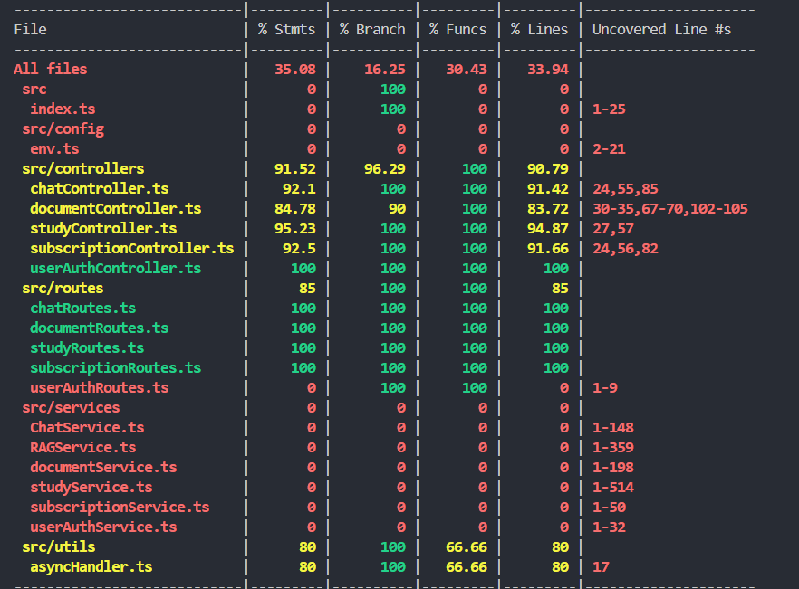

# Example M5: Testing and Code Review

## 1. Change History

| **Change Date**   | **Modified Sections** | **Rationale** |
| ----------------- | --------------------- | ------------- |
| _Nothing to show_ |

---

## 2. Back-end Test Specification: APIs

### 2.1. Locations of Back-end Tests and Instructions to Run Them

#### 2.1.1. Tests

| **Interface**                 | **Describe Group Location, No Mocks**                | **Describe Group Location, With Mocks**            | **Mocked Components**              |
| ----------------------------- | ---------------------------------------------------- | -------------------------------------------------- | ---------------------------------- |
| **POST /auth/login** | [backend/src/tests/unmocked/userAuthRoutes.test.ts](https://github.com/jaidensiu/thinkr/blob/master/backend/src/tests/unmocked/userAuthRoutes.test.ts#L73) | [backend/src/tests/mocked/userAuthLogin.test](https://github.com/jaidensiu/thinkr/blob/master/backend/src/tests/mocked/userAuthLogin.test.ts#L49) | MongoDB |
| **GET /chat** | [backend/src/tests/unmocked/chatRoutes.test.ts](https://github.com/jaidensiu/thinkr/blob/master/backend/src/tests/unmocked/chatRoutes.test.ts#L79) | [backend/src/tests/mocked/chatRoutes.test](https://github.com/jaidensiu/thinkr/blob/master/backend/src/tests/mocked/chatRoutes.test.ts#L40) | MongoDB, LangChain OpenAI |
| **POST /chat/message** | [backend/src/tests/unmocked/chatRoutes.test.ts](https://github.com/jaidensiu/thinkr/blob/master/backend/src/tests/unmocked/chatRoutes.test.ts#L221) | [backend/src/tests/mocked/chatRoutes.test.ts](https://github.com/jaidensiu/thinkr/blob/master/backend/src/tests/mocked/chatRoutes.test.ts#L69) | MongoDB, LangChain OpenAI |
| **DELETE /chat/history** | [backend/src/tests/unmocked/chatRoutes.test.ts](https://github.com/jaidensiu/thinkr/blob/master/backend/src/tests/unmocked/chatRoutes.test.ts#L343) | [backend/src/tests/mocked/chatRoutes.test.ts](https://github.com/jaidensiu/thinkr/blob/master/backend/src/tests/mocked/chatRoutes.test.ts#L111) | MongoDB |
| **POST /document/upload** | [backend/src/tests/unmocked/documentRoutes.test.ts](https://github.com/jaidensiu/thinkr/blob/master/backend/src/tests/unmocked/documentRoutes.test.ts#L90) | [backend/src/tests/mocked/documentRoutes.test.ts](https://github.com/jaidensiu/thinkr/blob/master/backend/src/tests/mocked/documentRoutes.test.ts#L75) | MongoDB, AWS S3, AWS Textract |
| **DELETE /document/delete** | [backend/src/tests/unmocked/documentRoutes.test.ts](https://github.com/jaidensiu/thinkr/blob/master/backend/src/tests/unmocked/documentRoutes.test.ts#L255) | [backend/src/tests/mocked/documentRoutes.test.ts](https://github.com/jaidensiu/thinkr/blob/master/backend/src/tests/mocked/documentRoutes.test.ts#L119) | MongoDB, AWS S3 |
| **GET /document/retrieve** | [backend/src/tests/unmocked/documentRoutes.test.ts](https://github.com/jaidensiu/thinkr/blob/master/backend/src/tests/unmocked/documentRoutes.test.ts#L362) | [backend/src/tests/mocked/documentRoutes.test.ts](https://github.com/jaidensiu/thinkr/blob/master/backend/src/tests/mocked/documentRoutes.test.ts#L156) | MongoDB |
| **GET /study/quiz** | [backend/src/tests/unmocked/studyRoutes.test.ts](https://github.com/jaidensiu/thinkr/blob/master/backend/src/tests/unmocked/studyRoutes.test.ts#L165) | [backend/src/tests/mocked/studyRoutes.test.ts](https://github.com/jaidensiu/thinkr/blob/master/backend/src/tests/mocked/studyRoutes.test.ts#L67) | MongoDB |
| **GET /study/flashcards** | [backend/src/tests/unmocked/studyRoutes.test.ts](https://github.com/jaidensiu/thinkr/blob/master/backend/src/tests/unmocked/studyRoutes.test.ts#L87) | [backend/src/tests/mocked/studyRoutes.test.ts](https://github.com/jaidensiu/thinkr/blob/master/backend/src/tests/mocked/studyRoutes.test.ts#L38) | MongoDB |
| **GET /study/suggestedMaterials** | [backend/src/tests/unmocked/studyRoutes.test.ts](https://github.com/jaidensiu/thinkr/blob/master/backend/src/tests/unmocked/studyRoutes.test.ts#L261) | [backend/src/tests/mocked/studyRoutes.test.ts](https://github.com/jaidensiu/thinkr/blob/master/backend/src/tests/mocked/studyRoutes.test.ts#L94) | MongoDB, Vector Database (ChromaDB) |
| **POST /subscription** | [backend/src/tests/unmocked/subscriptionRoutes.test.ts](https://github.com/jaidensiu/thinkr/blob/master/backend/src/tests/unmocked/subscriptionRoutes.test.ts#L43) | [backend/src/tests/mocked/subscriptionRoutes.test.ts](https://github.com/jaidensiu/thinkr/blob/master/backend/src/tests/mocked/subscriptionRoutes.test.ts#L34) | MongoDB |
| **DELETE /subscription** | [backend/src/tests/unmocked/subscriptionRoutes.test.ts](https://github.com/jaidensiu/thinkr/blob/master/backend/src/tests/unmocked/subscriptionRoutes.test.ts#L144) | [backend/src/tests/mocked/subscriptionRoutes.test.ts](https://github.com/jaidensiu/thinkr/blob/master/backend/src/tests/mocked/subscriptionRoutes.test.ts#L63) | MongoDB |
| **GET /subscription** | [backend/src/tests/unmocked/subscriptionRoutes.test.ts](https://github.com/jaidensiu/thinkr/blob/master/backend/src/tests/unmocked/subscriptionRoutes.test.ts#L224) | [backend/src/tests/mocked/subscriptionRoutes.test.ts](https://github.com/jaidensiu/thinkr/blob/master/backend/src/tests/mocked/subscriptionRoutes.test.ts#L92) | MongoDB |


#### 2.1.2. Commit Hash Where Tests Run

```101301a fix: Codacy backend warnings```

#### 2.1.3. Explanation on How to Run the Tests

1. **Clone the Repository**:

   - Open your terminal and run:
     ```
     git clone https://github.com/jaidensiu/thinkr.git
     ```

2. **Build and Run Backend tests**

   - `cd backend`
   - `npm install`
   - `npm run build`
   - `npm run test` OR `npm run test:coverage` (with code coverage)
   - NOTE: for non-functional tests, you will need an environment variable in a `.env` file in the `backend` directory, please contact the team for this variable when needed

### 2.2. GitHub Actions Configuration Location

`~/.github/workflows/backend-ci.yml` 

`~/.github/workflows/frontend-ci.yml`

### 2.3. Jest Coverage Report Screenshots With Mocks



### 2.4. Jest Coverage Report Screenshots Without Mocks


---

## 3. Back-end Test Specification: Tests of Non-Functional Requirements

### 3.1. Test Locations in Git

| **Non-Functional Requirement**  | **Location in Git**                              |
| ------------------------------- | ------------------------------------------------ |
| **Document Similarity Search Performance**          | [`backend\src\tests\nonfunctional\similaritySearchPerformance.test.ts`](https://github.com/jaidensiu/thinkr/blob/master/backend/src/tests/nonfunctional/similaritySearchPerformance.test.ts) |
| **Document Upload and Study Material Generation Performance** | [`backend\src\tests\nonfunctional\quizGenerationPerformance.test.ts`](https://github.com/jaidensiu/thinkr/blob/master/backend/src/tests/nonfunctional/quizGenerationPerformance.test.ts) |

### 3.2. Test Verification and Logs

- **Document Similarity Search Performance**

  - **Verification:** This test simulates a single API call with Jest to the endpoint that performs a similarity search between different users' documents and returns the study materials that are most similar to what the caller has been studying. The focus is on the time it takes for this similarity search to finish, which we identified as no more than 11.3 seconds based on our design specifications. The test logs capture the response time of the call to the endpoint and the performance margin (difference between response time and threshold time). We then analyze these logs to verify that performance standards are met and don't hinder user experience.

  - **Log Output**
    ```
    PERFORMANCE SUMMARY: Suggested Materials Request
           -----------------------------------------------
           ✧ Response Time:      0.35 seconds
           ✧ Threshold:          11.3 seconds
           ✧ Performance Margin: 10.95 seconds
           ✧ Status:             PASSED ✅
           -----------------------------------------------

      at src/tests/nonfunctional/similaritySearchPerformance.test.ts:29:17

    PASS  src/tests/nonfunctional/similaritySearchPerformance.test.ts (5.14 s)
    ```

- **Document Upload and Study Material Generation Performance**
  - **Verification:** This test simulates a single API call with Jest to the endpoint that uploads a document to the application and polls the document endpoint to verify that quizzes and flashcards were generated. The focus is on the time it takes to upload a document and for quizzes and flashcards to be generated, which we identified as no more than 11.3 seconds based on our design specifications. The test logs capture the response time of the call to the endpoint and the performance margin (difference between response time and threshold time). We then analyze these logs to verify that performance standards are met and don't hinder user experience. **Note that currently, this NFR is not met as we are using a weaker OCR service from AWS Textract due to this project still being in the MVP phase.**
  - **Log Output**
    ```
    PERFORMANCE SUMMARY: Quiz/Flashcard Generation
               -----------------------------------------------
               ✧ Response Time:      17.34 seconds
               ✧ Threshold:          11.3 seconds
               ✧ Performance Margin: -6.04 seconds
               ✧ Status:             FAILED ❌
               -----------------------------------------------

    at src/tests/nonfunctional/quizGenerationPerformance.test.ts:69:21
    ```

---

## 4. Front-end Test Specification

### 4.1. Location in Git of Front-end Test Suite:

`frontend/app/src/androidTest/java/com/example/thinkr/`

### 4.2. Tests


#### **Main Success Scenario**

2. The app shows input fields for "Name" and "Context", along with an "Upload" button.
3. The user enters a valid document name and context. The "Upload" button is enabled.
4. The user presses the "Upload" button.
5. The document is uploaded successfully, and the user is navigated to the home screen.

#### **Failure Scenarios**
3a. The user inputs an empty document name.

5a. The document upload fails due to network issues or API failure.
- 5a1. The app displays an error message.
- 5a2. The user is not navigated away from the screen.
5b. The app throws an exception during upload.
- 5b1. The app displays an error message.
- 5b2. The user is not navigated away from the screen.

#### **Test Case Specification**

| **Scenario Steps** | **Test Case Steps** |
|--------------------|--------------------|
| 1. The user opens "Upload Document" screen | Open "Upload Document" screen |
| 2. The app displays input fields and "Upload" button | Check for "Name" and "Context" fields and "Upload" button |
| | Verify "Upload" button is disabled initially |
| 3. The user inputs a valid document name and context | Input "Test Document" in "Name" field |
| | Input "This is a test document context" in "Context" field |
| | Verify "Upload" button is enabled |
| 4. The user presses the "Upload" button | Click "Upload" button |
| 5. The document is uploaded successfully | Verify navigation to "Home" screen |

#### **Failure Cases**

| **Scenario Steps** | **Test Case Steps** |
|--------------------|--------------------|
| 3a. The user inputs an empty document name | Leave "Name" field empty |
| 3a1. The app displays an error message | Click "Upload" button and verify error message |
| 5a. The document upload fails due to network issues | Mock API failure |
| 5a1. The app displays an error message | Verify error message is displayed |
| 5a2. The user is not navigated away | Verify no navigation occurs |
| 5b. The app throws an exception during upload | Mock API exception |
| 5b1. The app displays an error message | Verify error message is displayed |
| 5b2. The user is not navigated away | Verify no navigation occurs |

#### **Additional Tests**

  - Click "Back" button
  - Verify navigation to "Home" screen
- **Text Field Limits:**
  - Input excessive text into "Name" and "Context" fields
  - Verify input is limited to max length


### **Use Case: Chat with AI**

#### **Main Success Scenario**

2. The AI responds contextually based on the uploaded documents.
3. The AI returns responses in the chat.

#### **Failure Scenarios**
1a. The app fails to return a response due to a network error.

2b. The user's message exceeds the context length limit.
- 2b1. The "Send" button is disabled, preventing message submission until shortened.

#### **Test Case Specification**

| **Scenario Steps** | **Test Case Steps** |
|--------------------|--------------------|
| 1. The user opens "Chat with AI" screen | Open "Chat with AI" screen |
| 2. The AI returns context-aware responses | Send message: "Hello AI" |
| | Verify AI response is displayed |
| 3. The AI understands uploaded document information | Upload document and ask a related question |
| | Verify AI responds with relevant content |

#### **Failure Cases**

| **Scenario Steps** | **Test Case Steps** |
|--------------------|--------------------|
| 1a. App fails to return a response due to a network error | Simulate network failure |
| 1a1. Show an error message | Verify message: "Check your connection" is displayed |
| 2b. User message exceeds length limit | Input an overly long message |
| 2b1. Disable "Send" button | Verify "Send" button is disabled |

#### **Additional Tests**
- **Back Button Navigation:**
  - Click "Back" button
  - Verify navigation back happens
- **Chat History Loads Correctly:**
  - Open "Chat with AI" screen
  - Verify previous messages are displayed
- **Clear Chat History:**
  - Click "Delete Chat"
  - Verify messages are removed


### **Use Case: View Generated Flashcards and Quizzes**

#### **Main Success Scenario**
1. User can access AI-generated flashcards based on the uploaded document.
2. User can access AI-generated quizzes based on the uploaded document.

#### **Failure Scenarios**
1a. Flashcards or quizzes fail to generate due to an error.
   - 1a1. The app displays an error message and redirects the user to the home screen.

#### **Test Case Specification**

| **Scenario Steps** | **Test Case Steps** |
|--------------------|--------------------|
| 1. User accesses AI-generated flashcards | Open "Flashcards" screen |
| | Verify flashcards are displayed correctly |
| 2. User accesses AI-generated quizzes | Open "Quiz" screen |
| | Verify quiz questions and options are displayed correctly |

#### **Failure Cases**

| **Scenario Steps** | **Test Case Steps** |
|--------------------|--------------------|
| 1a. Flashcards or quizzes fail to generate | Simulate missing flashcard or quiz data |
| 1a1. App displays an error and redirects to home | Verify error message is displayed and user is redirected to "Home" screen |

#### **Additional Tests**
- **Navigation to Flashcards and Quizzes:**
  - Click "Review Flashcards"
  - Verify navigation to "Flashcards" screen
  - Click "Take Quiz"
  - Verify navigation to "Quiz" screen
- **Quiz Interaction:**
  - Answer quiz questions and submit
  - Verify score is displayed
- **Flashcard Interaction:**
  - Swipe through flashcards and verify transitions
- **Handling of Errors:**
  - Test app behavior when flashcards or quiz data is unavailable


---

## 5. Automated Code Review Results

### 5.1. Commit Hash Where Codacy Ran

`[Insert Commit SHA here]`

### 5.2. Unfixed Issues per Codacy Category

_(Placeholder for screenshots of Codacy’s Category Breakdown table in Overview)_

### 5.3. Unfixed Issues per Codacy Code Pattern

_(Placeholder for screenshots of Codacy’s Issues page)_

### 5.4. Justifications for Unfixed Issues

- **Code Pattern: [No unused vars](#)**

  1. **Issue: `'req' is defined but never used` in `asyncHandler.ts`**

     - **Location in Git:** [`backend/src/utils/asyncHandler.ts#L10`](#)
     - **Justification:** 
      The `req` parameter in `asyncHandler.ts` is required by the function signature to maintain compatibility with Express middleware. While it is not explicitly used within the function body, it must remain in place to adhere to Express middleware conventions. 

      According to the **Express.js documentation**, middleware functions must include three parameters: `req`, `res`, and `next` (or four parameters for error-handling middleware). Removing `req` would break the expected function signature, potentially causing issues when integrating with Express.

      Additionally, tools such as **ESLint** allow ignoring unused parameters in function signatures when required for compliance with frameworks. The appropriate rule that applies here is `@typescript-eslint/no-unused-vars`, which allows ignored parameters via underscore prefixes (`_req`) or by modifying ESLint settings to allow unused variables in specific cases.

      #### **Citations:**
      - [Express.js Documentation on Middleware](https://expressjs.com/en/guide/writing-middleware.html)
      - [ESLint: no-unused-vars Rule](https://eslint.org/docs/latest/rules/no-unused-vars)

      Since removing `req` would break the expected function signature, and Express.js requires its presence, this issue does not require fixing.

  2. **Issue: `'res' is defined but never used` in `asyncHandler.ts`**

     - **Location in Git:** [`backend/src/utils/asyncHandler.ts#L11`](#)
     - **Justification:** 
      The `res` parameter in `asyncHandler.ts` is required by the function signature to maintain compatibility with Express middleware. While it is not explicitly used within the function body, it must remain in place to adhere to Express middleware conventions. 

      The justification for this issue is the same as the previous one.

      #### **Citations:**
      - [Express.js Documentation on Middleware](https://expressjs.com/en/guide/writing-middleware.html)
      - [ESLint: no-unused-vars Rule](https://eslint.org/docs/latest/rules/no-unused-vars)

      Since removing `req` would break the expected function signature, and Express.js requires its presence, this issue does not require fixing.

  3. **Issue: `'next' is defined but never used` in `asyncHandler.ts`**

     - **Location in Git:** [`backend/src/utils/asyncHandler.ts#L12`](#)
     - **Justification:** 
      The `next` parameter in `asyncHandler.ts` is required by the function signature to maintain compatibility with Express middleware. While it is not explicitly used within the function body, it must remain in place to adhere to Express middleware conventions. 

      The justification for this issue is the same as the previous one.

      #### **Citations:**
      - [Express.js Documentation on Middleware](https://expressjs.com/en/guide/writing-middleware.html)
      - [ESLint: no-unused-vars Rule](https://eslint.org/docs/latest/rules/no-unused-vars)

      Since removing `req` would break the expected function signature, and Express.js requires its presence, this issue does not require fixing.

- **Code Pattern: [No unsafe return](#)**

  1. **Issue: `Unsafe return of an error typed value` in `RAGService.ts`**

     - **Location in Git:** [`backend/src/services/RAGService.ts#L211`](#)
     - **Justification:** 
      The issue is flagged because the `catch (error)` block does not explicitly type `error`, which may lead to unsafe returns if `error` is not properly handled. However, in this case, the error is **only logged and not returned**, making the concern largely irrelevant in practice.

      The `return docs ?? ([] as Document<DocumentMetadata>[]);` statement is executed before the `catch` block, meaning no erroneous or unsafe values are returned. This pattern is commonly used in handling failures gracefully without exposing internal errors to the caller.

      Additionally, in the context of **ChromaDB**, issues may arise if an unexpected error occurs during document retrieval. However, logging errors while ensuring that the function still returns a valid default value (`[]` in this case) aligns with best practices in robust error handling.

      To suppress this Codacy warning while maintaining safe error handling, an explicit type assertion for `error` (e.g., `error as unknown`) could be used, but it is **not required for functional correctness**.

      #### **Citations:**
      - [TypeScript Handbook: More on Type Safety](https://www.typescriptlang.org/docs/handbook/2/narrowing.html#using-type-assertions)
      - [ChromaDB Documentation](https://docs.trychroma.com/)

      Since the function already ensures a valid return type and the error is only logged (not returned), this issue does not require fixing.

  2. **Issue: `Unsafe return of an error typed value` in `RAGService.ts`**

     - **Location in Git:** [`backend/src/services/RAGService.ts#L351`](#)
     - **Justification:** 
      This issue is flagged because TypeScript does not infer a specific type for the `error` variable in the `catch` block, leading to a potential type safety warning. However, this warning does **not impact functional correctness** because the error is **only logged and not returned**.

      The function returns `results` before the `catch` block executes, ensuring that an error value is never propagated as a return value. If an error occurs, it is caught and logged via `console.error`, preventing the function from returning an unintended value.

      This pattern is a common **best practice in error handling**, ensuring that unexpected issues are recorded without causing unsafe return behavior. 

      To suppress this warning, an explicit type assertion (`error as unknown`) or TypeScript's built-in `unknown` type could be used. However, this is **not necessary for correctness**, as the function does not return `error`.

      #### **Citations:**
      - [TypeScript Handbook: More on Type Safety](https://www.typescriptlang.org/docs/handbook/2/narrowing.html#using-type-assertions)
      - [Error Handling Best Practices in TypeScript](https://typescript.dev/reference/errors.html)

      Since the function already ensures a valid return type and the error is only logged (not returned), this issue does not require fixing.

- **Code Pattern: [Others](#)**

  1. **Issue: `Generic Object Injection Sink` in `env.ts`**

     - **Location in Git:** [`backend/src/config/env.ts#L21`](#)
     - **Justification:** 
      This issue is flagged because `process.env[name]` is dynamically accessed using a variable (`name`), which could potentially allow **uncontrolled user input** to influence the environment variable lookup. However, in this specific case, the risk of injection is mitigated due to the following reasons:

      The `name` parameter is typed as `EnvVar`, which likely represents an **enumerated set of allowed environment variables**. This prevents arbitrary user input from accessing unintended environment variables.

      Also, the function **only reads** environment variables and does not modify them, preventing security risks such as arbitrary code execution.

      ### **Citations:**
      - [Node.js Documentation: `process.env`](https://nodejs.org/api/process.html#processenv)

      Since `name` is type-restricted and no unsafe modifications occur, this issue does not require fixing.

  2. **Issue: `'any' overrides all other types in this union type` in `RAGService.ts`**

     - **Location in Git:** [`backend/src/services/RAGService.ts#L42`](#)
     - **Justification:** 
      This issue is flagged because one of the type declarations in the file includes `any` within a union type, which effectively **negates type safety** for that type. However, in this specific case, the issue is **likely caused by ChromaDB's TypeScript typings**, which may use `any` internally in its type definitions.

      The issue stems from ChromaDB’s TypeScript definitions, so it **originates from an external package**, not from the project's code.  

      It is also important to note that while `any` weakens type safety, it **does not introduce runtime errors**.

      ### **Citations:**
      - [ChromaDB Documentation](https://docs.trychroma.com/)
      - [TypeScript Handbook: The `any` Type](https://www.typescriptlang.org/docs/handbook/basic-types.html#any)

      Since this issue originates from an external library’s typing and does not impact runtime correctness, it does not require fixing unless a dependency update provides an explicit solution.

  3. **Issue: `Unsafe argument of type any assigned to a parameter of type RequestHandler` in `documentRoutes.ts`**

     - **Location in Git:** [`backend/src/routes/documentRoutes.ts#L15`](#)
     - **Justification:** 
      This issue arises because `asyncHandler(uploadDocuments)` is passed to `router.post()`, and `asyncHandler` does not explicitly enforce the expected `RequestHandler` type signature. However, this does not introduce a functional issue since `uploadDocuments` is already structured as an Express middleware.

      The `asyncHandler` function wraps `uploadDocuments` to handle errors in an `async` context, which may cause TypeScript to lose type inference and default to `any`. Despite this, the underlying function still adheres to Express's middleware expectations and will not cause runtime errors. 

      This warning is primarily a TypeScript inference limitation rather than an actual safety risk. Since the function does not introduce unexpected behavior, no changes are required.

      #### **Citations:**
      - [Express.js Middleware Documentation](https://expressjs.com/en/guide/writing-middleware.html)
      - [TypeScript Handbook: Function Types](https://www.typescriptlang.org/docs/handbook/2/functions.html)


### Frontend Issues
All of the remaining issues are related to the number of lines or the complexity of composables. Over-fragmenting Composables can harm readability, reusability, and performance due to unnecessary recompositions and complex state management.  
Sources:  

- Official Jetpack Compose documentation: [Thinking in Compose](https://developer.android.com/jetpack/compose/mental-model)  

#### **MainActivity - Too Many Functions**

- **Justification:** `MainActivity` serves as the entry point for the application and needs to manage essential lifecycle and UI-related functions. Given its role, splitting it into multiple files would add unnecessary complexity without significant maintainability benefits. [Source: Android Developers - Activity Lifecycle](https://developer.android.com/guide/components/activities/activity-lifecycle).

---

#### **ProfileScreen - Too Many Lines of Code**

- **Justification:** The additional lines result from necessary UI composition, including handling state and effects within Jetpack Compose. Refactoring would require breaking down UI elements, which may not provide a meaningful readability improvement. [Source: Google Developer Guide on Compose Best Practices](https://developer.android.com/jetpack/compose/performance).

---

#### **FilePickerDialog - Anonymous Function Too Long**
- **Issue:** Anonymous function inside `FilePickerDialog` has 62 lines (limit is 50).
- **Justification:** The function handles file selection, user permissions, and UI updates in a single location to reduce complexity elsewhere. Extracting logic into separate functions may make debugging more difficult. [Source: Google’s Guide on Managing Permissions](https://developer.android.com/training/permissions/requesting).

---

#### **AnimatedCard - Too Many Lines, High Complexity**
- **Issues:**  
  - `AnimatedCard` has 132 lines (limit is 50).  
  - Cyclomatic complexity of 11 (limit is 8).  
  - Too many parameters (threshold is 6).  
- **Justification:** `AnimatedCard` is a self-contained UI component handling multiple user interactions (swipe gestures, flipping animations, state changes). Extracting its logic into separate composables would add unnecessary indirection without significantly improving readability. [Source: Jetpack Compose Performance Optimization](https://developer.android.com/jetpack/compose/performance).

---

#### **FlashcardsScreen - Too Many Lines**
- **Issue:** `FlashcardsScreen` is 71 lines long (limit is 60).
- **Justification:** The screen requires managing UI composition and state transitions. Extracting state management could introduce unnecessary complexity without significant readability benefits. [Source: Google’s Guide on State and Jetpack Compose](https://developer.android.com/jetpack/compose/state).

---

#### **HomeScreenContent - Too Many Lines**
- **Issue:** `HomeScreenContent` is 122 lines long (limit is 60).
- **Justification:** Home screen composition involves several nested UI components. Extracting subcomponents would increase the number of function calls without improving code clarity. [Source: Jetpack Compose UI Structuring](https://developer.android.com/jetpack/compose/performance).

---

#### **DocumentUploadScreen - Too Many Lines**
- **Issue:** `DocumentUploadScreen` has 97 lines (limit is 50).
- **Justification:** This function manages file selection, uploading, and UI updates. Splitting it would make tracking the upload process harder without clear benefits. [Source: Android File Management Best Practices](https://developer.android.com/training/data-storage).

---

#### **QuizScreen - Too Many Lines**
- **Issue:** `QuizScreen` has 107 lines (limit is 50).
- **Justification:** The function is structured to handle multiple quiz states and UI updates efficiently. Extracting logic would add unnecessary fragmentation without improving maintainability. [Source: Jetpack Compose State Handling](https://developer.android.com/jetpack/compose/state).

---

#### **ChatScreen - Too Many Lines**
- **Issue:** `ChatScreen` has 114 lines (limit is 60).
- **Justification:** The screen involves handling real-time chat updates, UI animations, and message rendering. Splitting it into multiple functions would not improve clarity but would add function calls. [Source: Google Developer Guide on Real-Time Messaging](https://firebase.google.com/docs/firestore/manage-data/real-time).

---

#### **MultipleChoiceQuizCard - Too Many Parameters**
- **Issue:** `MultipleChoiceQuizCard` has more than 6 parameters.
- **Justification:** The parameters define necessary quiz attributes such as state, index, and choices. Reducing parameters would require wrapping them into a data class, which may reduce readability. [Source: Kotlin Best Practices - Function Parameters](https://kotlinlang.org/docs/coding-conventions.html#function-parameter-lists).

---

#### **LandingScreen - Too Many Lines**
- **Issue:** `LandingScreen` has 76 lines (limit is 60).
- **Justification:** The screen includes necessary UI elements and state management, making further decomposition unnecessary. [Source: Jetpack Compose UI Best Practices](https://developer.android.com/jetpack/compose/performance).

---
